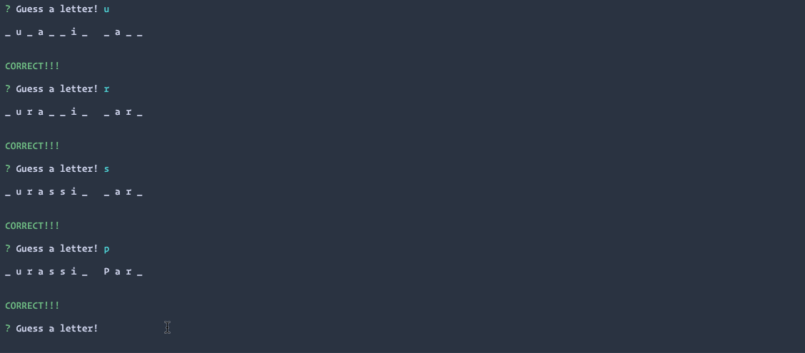

# Constructor-Hangman
- - -
### Creating a hangman command-line game using constructor functions.

- - -
## Parks and Rec Hangman Game
### Guess the Parks and Rec Character!

- - -
### How to Play!
1. Game will Prompt you If you are ready to Start!

2. The app randomly picks a character from the Parks and Recreation TV Show, and the user has to guess the character correctly by typing letters the user thinks is in the character's name.

3. Wins: (# of times user guessed the word correctly).

   * If the word is `ben`, display it like this when the game starts: `_ _ _`.

   * As the user guesses the correct letters, reveal them: `b _ _ `.

4. Number of Guesses Remaining: (# of guesses remaining for the user).

5. Letters Already Guessed: (Letters the user has guessed, displayed like `L Z Y H`).

6. After the user wins/loses the game should automatically choose another word and make the user play it.

- - -
### Install These Packages
1. npm init --y
    * npm init -y sets up a project with defaults, that is pretty useful for test projects or prototyping and initialize a `package.json` file for your project.
2. npm install --save
    * npm install will install all modules listed as dependencies in package.json
3. npm install inquirer --save
   * [Inquirer](https://www.npmjs.com/package/inquirer)